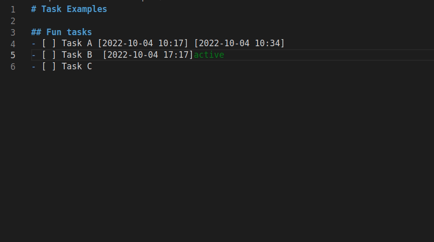
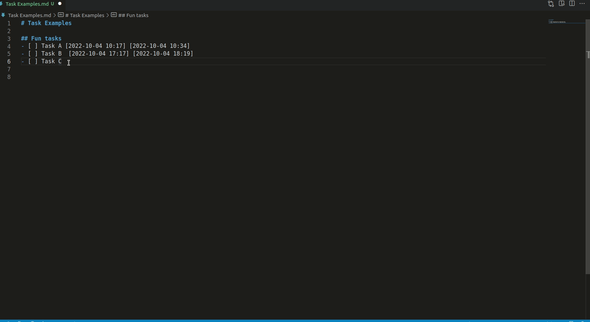
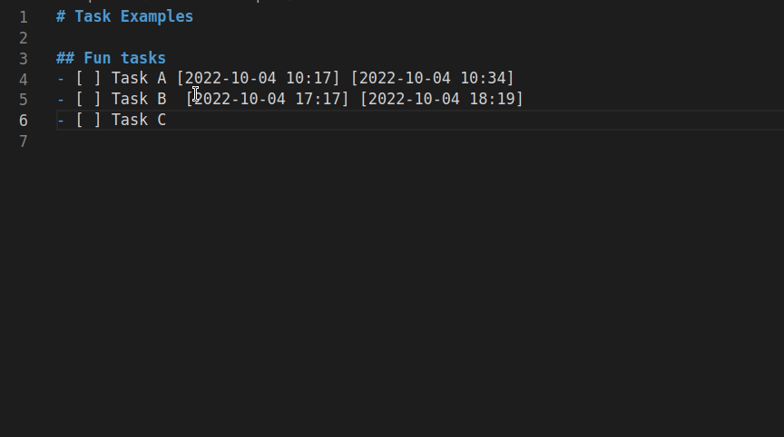

# Markdown Task Timer 

Add timers to your markdown task-list and get a report summarizing your efforts. 

## Features

- add timestamps to todo-tasks. The timestamp format is `[YYYY-MM-DD hh:mm]`.
- indicate active tasks in editor
- show timer in status bar whenever there is an active task
- make a comprehensive report
- cycle through task state with key-shortcuts (text -> bullet -> in work -> done -> text)  

## Usage

Place cursor in a line with a markdown task and press `ctrl+alt+l` to add a timestamp. Existing active tasks will be set inactive before a new one is activated. A timer in the status bar indicates the elapsed time of the current active task.

Use the `makeReport`-Command to get a markdown-formatted summary of your timestamps. 

Use `ctrl+alt+[Period]` for promoting, or `ctrl+alt+[Comma]` for demoting text lines to 'done'-state or vice-versa.

## Release Notes

### 0.1.0

Initial release

## For more information

* [Visual Studio Code's Markdown Support](http://code.visualstudio.com/docs/languages/markdown)
* [Markdown Syntax Reference](https://help.github.com/articles/markdown-basics/)

**Enjoy!**
